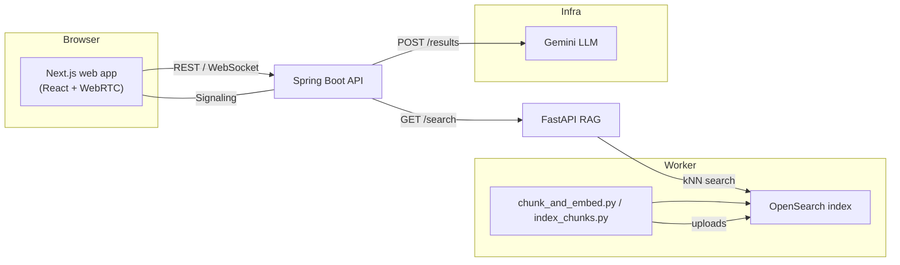

# Did-I-Cook? 

A real-time, AI-judged debate app where two players debate a topic on video and an AI (Gemini) scores them with evidence-backed reasoning using a RAG pipeline (OpenSearch + embeddings). The project includes a Next.js frontend, a Spring Boot backend (API + signaling), and Python worker scripts to chunk/embed and index evidence into OpenSearch.

---

## Table of contents
- [Architecture](#architecture)
- [Tech Stack](#tech-stack)
- [Local development](#local-development)
- [RAG pipeline](#rag-pipeline)
- [Gemini & prompt notes](#gemini--prompt-notes)
- [UX & features](#ux--features)
- [Troubleshooting](#troubleshooting)
- [Contributing](#contributing)

---

## Architecture

Mermaid (rendered on GitHub when enabled):



ASCII fallback:

Browser (Next.js + WebRTC) -> Spring Boot API (signals & results) -> Gemini (LLM)
                                         |
                                         -> FastAPI / OpenSearch (RAG evidence)
                                         <- Worker (chunk/embed -> index)

---

## Tech Stack

- Frontend: Next.js (App Router), React, Tailwind CSS, Framer Motion, react-confetti
- Backend: Spring Boot (Java 21), REST controllers, WebRTC signaling
- RAG worker: Python, FastAPI, HuggingFace SentenceTransformers (all-MiniLM-*), OpenSearch (k-NN)
- LLM: Google Gemini (via REST) with prompt → JSON parsing

---

## Local development

Prereqs: Node.js, Java 21 + Maven, Python 3.11+, OpenSearch (or remote), Git

1. Frontend (apps/web)
   - cd apps/web
   - npm install
   - npm run dev
   - Open http://localhost:3000

2. Backend API (apps/api)
   - cd apps/api
   - mvn spring-boot:run
   - Config via `src/main/resources/application.properties` (or environment vars)

3. Worker / RAG (apps/worker)
   - python -m venv .venv
   - .venv\Scripts\activate (. ./venv/bin/activate on mac/linux)
   - pip install -r requirements.txt
   - uvicorn semantic_search_api:app --reload --port 8000
   - Use scripts in `apps/worker/scripts/` to chunk, embed, and index to OpenSearch

Environment variables (examples):

```env
# Gemini
GEMINI_API_KEY=<primary>
GEMINI_API_KEY2=<fallback>
# OpenSearch (for worker/fastapi)
OPENSEARCH_URL=http://localhost:9200
OPENSEARCH_USER=admin
OPENSEARCH_PASS=admin
```

Notes:
- The app will POST to `/api/debates/:id/results` to trigger scoring and RAG evidence retrieval.
- Use the RAG scripts to populate an OpenSearch index before relying on key-evidence output.

---

## RAG pipeline

- Chunk documents (PDFs, text) with `chunk_and_embed.py` or `index_chunks.py`.
- Embed using SentenceTransformers and store k-NN vectors in OpenSearch.
- `apps/worker/semantic_search_api.py` exposes `/search` used by the API to gather evidence chunks for prompts.

---

## Gemini & prompt notes

- Gemini is invoked from `apps/api/src/main/java/com/didicook/api/service/GeminiService.java`.
- Important behaviors implemented:
  - Attempts fallback API keys (GEMINI_API_KEY, GEMINI_API_KEY2..GEMINI_API_KEY5).
  - Transcript builder maps numeric speakers to real `player1Name` / `player2Name` when provided.
  - Sends an explicit JSON schema instruction (no sample payload embedded in final prod prompt) to avoid sample bias.

Tips:
- If you see parsing errors in the backend response, the returned text may include extra content — we try to extract the first top-level JSON object.
- For debugging, add a temporary log of the final prompt before sending (avoid logging secrets in production).

---

## UX & features

- In-call judging: users remain on the call while AI scores (results appear as a themed overlay)
- Animated judging state: an "AI is judging..." modal with subtle animations (framer-motion)
- Results page: flippable `CookbookCard` style cards (front/back), lined-paper background aesthetic
- Confetti shows only for the viewer when they are the winner (visitor-specific)
- Tie handling displays "It's a tie!" with no confetti
- Dev conveniences: sample-mode used during development earlier; currently the app fetches live results by default

---
